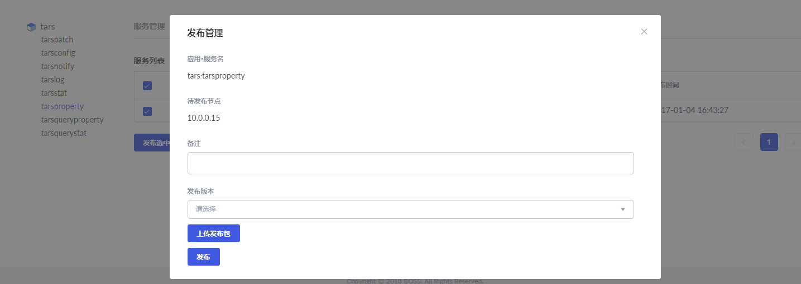
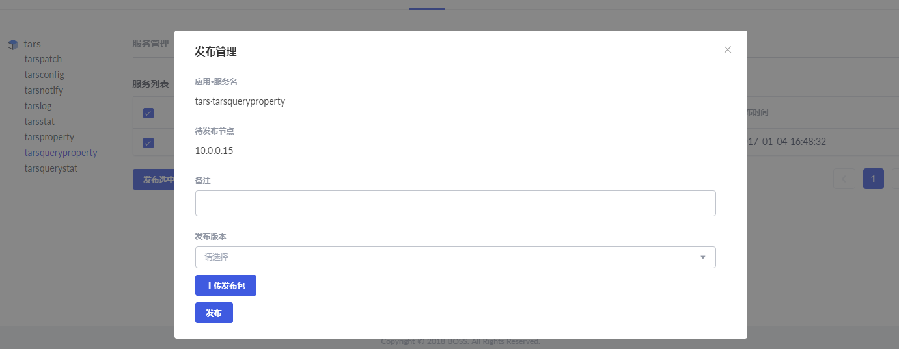

[Click me switch to English version](Install.md)

# 目录
> * [依赖环境](#chapter-1)
> * [Tars开发环境安装介绍](#chapter-2)
> * [Tars数据库环境初始化](#chapter-3)
> * [Tars框架运行环境搭建](#chapter-4)


本安装文档仅描述了在一台服务器上安装搭建整个Tars框架的过程，目的是为了让用户对Tars框架的部署搭建、运行、测试等有个整体的认识。

如要用于线上环境，部署安装的原理是一样，不过需要更多考虑分布式系统下服务的部署需要有容错、容灾等的能力。若有需要，可以加入tars的qq技术交流群：579079160。

# 1. <a id="chapter-1"></a>依赖环境

软件 |软件要求
------|--------
linux内核版本:      |	2.6.18及以上版本（操作系统依赖）
gcc版本:          	|   4.8.2及以上版本、glibc-devel（c++语言框架依赖）
bison工具版本:      |	2.5及以上版本（c++语言框架依赖）
flex工具版本:       |	2.5及以上版本（c++语言框架依赖）
cmake版本：       	|   2.8.8及以上版本（c++语言框架依赖）
mysql版本:          |   4.1.17及以上版本（框架运行依赖）
rapidjson版本:      |   1.0.2版本（c++语言框架依赖）
nvm版本：           |   0.33.11及以上版本（web管理系统依赖）
node版本：          |   8.11.3及以上版本（web管理系统依赖）

运行服务器要求：1台普通安装linux系统的机器即可。

## 1.1. glibc-devel安装介绍

如果没有安装glibc的开发库，需要先安装。

例如，在Centos下，执行：
```
yum install glibc-devel
```

## 1.2. cmake安装介绍
cmake是tars框架服务依赖的编译环境。

下载cmake-2.8.8源码包，解压：
```
tar zxvf cmake-2.8.8.tar.gz
```
进入目录：
```
cd cmake-2.8.8
```
进行如下操作：（选择适合自己的操作步骤）
```
./bootstrap(如果系统还没有安装CMake，源码中提供了一个 bootstrap 脚本)
make
make install(如果make install失败，一般是权限不够，切换root进行安装)
```

## 1.3. Mysql安装
下面提供两种安装方式，源码安装和yum安装
### 1.3.1 源码安装

源码安装可以对数据库进行自定义。

安装前，确定系统是否安装了ncurses、zlib，若没有，可以执行：
```
yum install ncurses-devel
yum install zlib-devel
```

设置安装目录，切换至root用户
```
cd /usr/local
mkdir mysql-5.6.26
chown ${普通用户}:${普通用户} ./mysql-5.6.26
ln -s /usr/local/mysql-5.6.26 /usr/local/mysql
```

用utf8的安装方式
下载mysql源码（这里使用的是mysql-5.6.26）,用utf8的安装方式mysql，解压后编译：
下面增加了mysql-5.6.26的安装方式
```
cd ${mysql安装目录}
wget https://dev.mysql.com/get/Downloads/MySQL-5.6/mysql-5.6.26.tar.gz
tar -zxvf mysql-5.6.26.tar.gz
cmake . -DCMAKE_INSTALL_PREFIX=/usr/local/mysql-5.6.26 -DWITH_INNOBASE_STORAGE_ENGINE=1 -DMYSQL_USER=mysql -DDEFAULT_CHARSET=utf8 -DDEFAULT_COLLATION=utf8_general_ci
make
make install
```
**注意，对于用Tars的c++进行开发编译的服务，mysql建议采用静态库，源码编译，避免所有服务器都要安装mysql的动态库。**


对于在服务器用Tars的c++进行开发编译服务代码而言，经过上面步骤就可以进行编译安装Tars开发框架了。

若要是搭建Tars框架的运行环境，需要以下步骤，切换至root用户，对mysql进行配置。
```shell
yum install perl
cd /usr/local/mysql
useradd mysql
rm -rf /usr/local/mysql/data
mkdir -p /data/mysql-data
ln -s /data/mysql-data /usr/local/mysql/data
chown -R mysql:mysql /data/mysql-data /usr/local/mysql/data
cp support-files/mysql.server /etc/init.d/mysql
**如果/etc/目录下有my.cnf存在，需要把这个配置删除了**
rm -rf /etc/my.cnf
yum install -y perl-Module-Install.noarch
perl scripts/mysql_install_db --user=mysql
vim /usr/local/mysql/my.cnf
```
补充了上面删除my.cnf的命令
rm -rf /etc/my.cnf

给一个my.cnf配置实例：

```cnf
[mysqld]

# Remove leading # and set to the amount of RAM for the most important data
# cache in MySQL. Start at 70% of total RAM for dedicated server, else 10%.
innodb_buffer_pool_size = 128M

# Remove leading # to turn on a very important data integrity option: logging
# changes to the binary log between backups.
log_bin

# These are commonly set, remove the # and set as required.
basedir = /usr/local/mysql
datadir = /usr/local/mysql/data
# port = .....
# server_id = .....
socket = /tmp/mysql.sock

bind-address=${your machine ip}

# Remove leading # to set options mainly useful for reporting servers.
# The server defaults are faster for transactions and fast SELECTs.
# Adjust sizes as needed, experiment to find the optimal values.
join_buffer_size = 128M
sort_buffer_size = 2M
read_rnd_buffer_size = 2M

sql_mode=NO_ENGINE_SUBSTITUTION,STRICT_TRANS_TABLES

```
**注意将bind-address改为部署机器的IP**

启动mysql
```
service mysql start
chkconfig mysql on
```
结束mysql
```
service mysql stop
```
添加mysql的bin路径
```
vim /etc/profile
PATH=$PATH:/usr/local/mysql/bin
export PATH
```
修改root密码(采用root密码)
```
./bin/mysqladmin -u root password 'root@appinside'
./bin/mysqladmin -u root -h ${主机名} password 'root@appinside'
```
**注意${主机名}需要修改成自身机器的名称，可以通过查看/etc/hosts**


添加mysql库路径
```
vim /etc/ld.so.conf
/usr/local/mysql/lib/
ldconfig
```

mysql主从配置可以参考网上教程

master赋予权限:
```
GRANT REPLICATION SLAVE ON *.* to 'mysql-sync'@'%' identified by 'sync@appinside'
```
slave设置主备同步项
```
change master to master_host='${备机Ip}',master_user='mysql-sync',master_password='sync@appinside' ,master_log_file='iZ94orl0ix4Z-bin.000004',master_log_pos=611;
stop slave
start slave
show master status\G;
show slave status\G;
```
**注意${备机Ip}需要修改成备机数据库的Ip**


### 1.3.2 yum安装
在mysql 5.7版本之后删除了源码中的mysql_install_db.sh安装脚本，因此上述方法不适用。
yum安装相对便捷，但是没办法实现自定义安装。如果对自定义安装有需求的请使用源码安装。
#### 1.3.2.1 从yum repository安装mysql
```
wget -i -c http://dev.mysql.com/get/mysql57-community-release-el7-10.noarch.rpm
yum -y install mysql57-community-release-el7-10.noarch.rpm
yum -y install mysql-community-server
yum -y install  mysql-devel
```
这样mysql就安装好了
其中wget中的库地址可以根据需要替换版本号
如果wget无法安装，可以尝试按照下述步骤将mysql repository添加到本地服务，然后再重新执行上述命令
```
sudo yum localinstall https://dev.mysql.com/get/mysql57-community-release-el7-10.noarch.rpm
```
#### 1.3.2.2 设置mysql
启动mysql并查看运行状态

```
systemctl start  mysqld.service
systemctl status mysqld.service
```
mysql开始运行并通过3306端口进行连接。

通过yum安装mysql的话root账号会默认设置一个密码，可以通过下面的方式获得。
```
grep "password" /var/log/mysqld.log
```
使用这个密码登陆root的账户。mysql要求必须更改密码才能做数据库操作。
如果你安装的mysql版本是5.7及以上，mysql的密码设置有安全性要求(长度、大小写、特殊字符)，以下两种方式可以选择
1. 设置满足要求的密码
2. 通过下面的方式降低密码安全性规则
```
mysql> set global validate_password_policy=0;
mysql> set global validate_password_length=1;
```
修改之后只有6个字符的最小长度限制
接着修改密码
```
mysql> ALTER USER 'root'@'localhost' IDENTIFIED BY '${your password}';
```


# 2. <a id="chapter-2"></a>Tars开发环境安装介绍
## 2.1. web管理系统开发环境安装
以linux环境为例：

安装npm,pm2
```
yum install -y npm
npm i -g pm2
```

以官网提供的nvm脚本安装
执行以下命令：
```
wget -qO- https://raw.githubusercontent.com/creationix/nvm/v0.33.11/install.sh | bash
source ~/.bashrc
```

node和带有负载功能的node应用的进程管理器pm2安装
```
nvm install v8.11.3
npm install -g pm2 --registry=https://registry.npm.taobao.org
```

### 2.2. c++ 开发环境安装

下载TarsFramework源码


```
cd ${source_folder}
git clone https://github.com/TarsCloud/TarsFramework.git --recursive
```


然后进入build源码目录
```
cd ${source_folder}/TarsFramework/build
chmod u+x build.sh
./build.sh prepare
./build.sh all
```

**编译时默认使用的mysql开发库路径：include的路径为/usr/local/mysql/include，lib的路径为/usr/local/mysql/lib/**

若mysql开发库的安装路径不在默认路径需要修改CMakeLists文件中mysql开发库的路径。CMakeLists在`${source_folder}/TarsFramework/`和`${source_folder}/TarsFramework/tarscpp/` 目录下各有一个同名文件。
修改文件中上述路径为本机mysql开发库的路径
(参考路径："/usr/include/mysql"；"/usr/lib64/mysql")。


如果需要重新编译
```
./build.sh cleanall
./build.sh all
```

切换至root用户，创建安装目录
```
cd /usr/local
mkdir tars
chown ${普通用户}:${普通用户} ./tars/
```

安装
```
cd ${source_folder}/build
./build.sh install或者make install
```
**默认的安装路径为/usr/local/tars/cpp。**

**如要修改安装路径：**
```
**需要修改tarscpp目录下CMakeLists.txt文件中的安装路径。**
**需要修改tarscpp/servant/makefile/makefile.tars文件中的TARS_PATH的路径**
**需要修改tarscpp/servant/script/create_tars_server.sh文件中的DEMO_PATH的路径**
```

# 3 <a id="chapter-3"></a>Tars数据库环境初始化
## 3.1. 添加用户
```sql
grant all on *.* to 'tars'@'%' identified by 'tars2015' with grant option;
grant all on *.* to 'tars'@'localhost' identified by 'tars2015' with grant option;
grant all on *.* to 'tars'@'${主机名}' identified by 'tars2015' with grant option;
flush privileges;
```

如果mysql版本大于5.7且没有修改密安全性规则，必须将整个项目的所有‘tars2015’一并修改成符合规则的密码。

**注意${主机名}需要修改成自身机器的名称，可以通过查看/etc/hosts

## 3.2. 创建数据库
sql脚本在framework/sql目录下，修改部署的ip信息
```
sed -i "s/192.168.2.131/${your machine ip}/g" `grep 192.168.2.131 -rl ./*`
sed -i "s/db.tars.com/${your machine ip}/g" `grep db.tars.com -rl ./*`
sed -i "s/10.120.129.226/${your machine ip}/g" `grep 10.120.129.226 -rl ./*`
```
**注意，192.168.2.131这个ip是tars开发团队当时部署服务测试的ip信息，替换成自己数据库的部署地址即可,不要是127.0.0.1**

**注意，db.tars.com是tars框架数据库部署的地址信息，替换成自己数据库的部署地址即可**

执行.
```
chmod u+x exec-sql.sh
./exec-sql.sh
```
**注意将${your machine ip}改为部署机器的IP**

**如果exec-sql.sh脚本执行出错，需要脚本里修改数据库用户名root对应的密码**

脚本执行后，会创建3个数据库，分别是db_tars、tars_stat、tars_property。

其中db_tars是框架运行依赖的核心数据库，里面包括了服务部署信息、服务模版信息、服务配置信息等等；

tars_stat是服务监控数据存储的数据库；

tars_property是服务属性监控数据存储的数据库；

# 4. <a id="chapter-4"></a>Tars框架运行环境搭建

## 4.1 框架基础服务打包

框架服务的安装分两种：

一种是核心基础服务(必须的)，必须手工部署的，

一种是普通基础服务(可选的)，可以通过管理平台发布的(和普通服务一样）。

```
手工部署的核心基础服务：tarsAdminRegistry, tarsregistry, tarsnode, tarsconfig, tarspatch
 
通过管理平台部署的普通基础服务：tarsstat, tarsproperty,tarsnotify, tarslog，tarsquerystat，tarsqueryproperty
```

首先准备第一种服务的安装包，在build/目录下输入：
```
make framework-tar
```
会在当前目录生成framework.tgz 包
这个包包含了 tarsAdminRegistry, tarsregistry, tarsnode, tarsconfig, tarspatch 部署相关的文件

第二种服务安装包可以单独准备：
```
make tarsstat-tar
make tarsnotify-tar
make tarsproperty-tar
make tarslog-tar
make tarsquerystat-tar
make tarsqueryproperty-tar
```
生成的发布包，在管理平台部署发布完成后，进行部署发布，具体参见4.4章节。

**注意在管理平台进行部署时，选择正确的服务模板即可（默认是有的，若没有相应的模版，可以在管理平台上创建，具体服务的模版内容可以tars_template.md）!**

## 4.2 安装框架核心基础服务

### 4.2.1. 安装核心基础服务

切换至root用户，创建基础服务的部署目录，如下：
```  shell
cd /usr/local/app
mkdir tars
chown ${普通用户}:${普通用户} ./tars/
```

将已打好的框架服务包复制到/usr/local/app/tars/，然后解压，如下：
``` shell
cp build/framework.tgz /usr/local/app/tars/
cd /usr/local/app/tars
tar xzfv framework.tgz
```

修改各个服务对应conf目录下配置文件，注意将配置文件中的ip地址修改为本机ip地址，如下：
``` shell
cd /usr/local/app/tars
sed -i "s/192.168.2.131/${your_machine_ip}/g" `grep 192.168.2.131 -rl ./*`
sed -i "s/db.tars.com/${your_machine_ip}/g" `grep db.tars.com -rl ./*`
sed -i "s/registry.tars.com/${your_machine_ip}/g" `grep registry.tars.com -rl ./*`
sed -i "s/web.tars.com/${your_machine_ip}/g" `grep web.tars.com -rl ./*`
```
**注意，192.168.2.131这个ip是tars开发团队当时部署服务测试的ip信息，替换成本机的部署地址即可，不要是127.0.0.1**

**注意，db.tars.com是tars框架数据库部署的地址信息，替换成自己数据库的部署地址即可**

**注意，registry.tars.com是tars框架主控tarsregistry服务部署的地址信息，替换成自己主控tarsregistry符的部署地址即可**

**注意，web.tars.com是rsync使用的地址信息，替换成自己的部署机器地址即可**

然后在/usr/local/app/tars/目录下，执行脚本，启动tars框架服务
```
chmod u+x tars_install.sh
./tars_install.sh
```
**注意如果几个服务不是部署在同一台服务器上，需要自己手工copy以及处理tars_install.sh脚本**

部署管理平台并启动web管理平台(管理平台必须和tarspatch部署在同一台服务器上)部署tarspatch，切换至root用户，并执行
```
tarspatch/util/init.sh
```
**注意，上面脚本执行后，看看rsync进程是否起来了，若没有看看rsync使用的配置中的ip是否正确（即把web.tars.com替换成本机ip）

在管理平台上面配置tarspatch，注意需要配置服务的可执行目录(/usr/local/app/tars/tarspatch/bin/tarspatch)

在管理平台上面配置tarsconfig，注意需要配置服务的可执行目录(/usr/local/app/tars/tarsconfig/bin/tarsconfig)

在crontab配置一个进程监控，确保TARS框架服务在出现异常后能够重新启动。
```
* * * * * /usr/local/app/tars/tarsnode/util/monitor.sh
```

### 4.2.2 服务扩容前安装tarsnode

核心基础服务的安装成功后，如果需要在其他机器也能部署基于tars框架的服务，那么在管理平台扩容部署前，需要安装tarsnode服务。

如果只是在一台机器部署服务进行测试，这一步可以先忽略，等到需要扩容时再执行。

具体步骤跟上一节很像，如下：

切换至root用户，创建基础服务的部署目录，如下：
```  shell
cd /usr/local/app
mkdir tars
chown ${普通用户}:${普通用户} ./tars/
```

将已打好的框架服务包复制到/usr/local/app/tars/，然后解压，如下：
``` shell
cp build/framework.tgz /usr/local/app/tars/
cd /usr/local/app/tars
tar xzfv framework.tgz
```

修改各个服务对应conf目录下配置文件，注意将配置文件中的ip地址修改为本机ip地址，如下：
``` shell
cd /usr/local/app/tars
sed -i "s/192.168.2.131/${your_machine_ip}/g" `grep 192.168.2.131 -rl ./*`
sed -i "s/db.tars.com/${your_machine_ip}/g" `grep db.tars.com -rl ./*`
sed -i "s/registry.tars.com/${your_machine_ip}/g" `grep registry.tars.com -rl ./*`
sed -i "s/web.tars.com/${your_machine_ip}/g" `grep web.tars.com -rl ./*`
```
**注意，192.168.2.131这个ip是tars开发团队当时测试的ip信息，替换成自己扩容机器的ip地址即可，不要是127.0.0.1**

**注意，db.tars.com是tars框架数据库部署的地址信息，替换成数据库的部署ip地址即可**

**注意，registry.tars.com是tars框架主控tarsregistry服务部署的地址信息，替换成自己主控tarsregistry的部署地址即可**

**注意，web.tars.com是rsync使用的地址信息，替换成web的部署机器地址即可**

然后在/usr/local/app/tars/目录下，执行脚本，启动tars框架服务
```
chmod u+x tarsnode_install.sh
./tarsnode_install.sh
```

在crontab配置一个进程监控，确保TARS框架服务在出现异常后能够重新启动。
```
* * * * * /usr/local/app/tars/tarsnode/util/monitor.sh
```

## 4.3 安装web管理系统

>管理系统源代码目录名称为**web**


也可以clone TarsWeb文件夹
```
git clone https://github.com/TarsCloud/TarsWeb.git
```


修改配置文件，将配置文件中的ip地址修改为本机ip地址，如下：
```
cd ${安装目录}
sed -i 's/db.tars.com/${your_machine_ip}/g' config/webConf.js
sed -i 's/registry.tars.com/${your_machine_ip}/g' config/tars.conf
```

安装web管理页面依赖，启动web
```
cd ${安装目录}
npm install --registry=https://registry.npm.taobao.org
npm run prd
```

创建日志目录
```
mkdir -p /data/log/tars
```

访问站点
浏览器输入${your machine ip}:3000，即可看到，如下：


**注意：安装后为了提供更好的安全防护，强烈建议开启[用户体系鉴权登陆模块](https://github.com/TarsCloud/TarsWeb/blob/master/docs/TARS%20%E7%94%A8%E6%88%B7%E4%BD%93%E7%B3%BB%E6%A8%A1%E5%9D%97%2B%E8%B5%84%E6%BA%90%E6%A8%A1%E5%9D%97%E4%BD%BF%E7%94%A8%E6%8C%87%E5%BC%95.md)。**

## 4.4. 安装框架普通基础服务
**平台部署的端口号仅供参考，保证端口无冲突即可**

在执行上述的make语句后，/usr/local/app/TarsFramework/build就会生成几个*.tgz文件，例如tarslog.tgz, tarsnotify.tgz等等，这些文件就是下面章节中所需要部署的包文件。

### 4.4.1 tarsnotify部署发布

默认tarsnotify在安装核心基础服务时，部署信息已初始化了，安装完管理平台后，就可以看到，如下：


上传发布包后，发布如下：


### 4.4.2 tarsstat部署发布

部署信息如下：


上传发布包后，发布如下：


### 4.4.3 tarsproperty部署发布

部署信息如下：


上传发布包后，发布如下：



### 4.4.4 tarslog部署发布

部署信息如下：


上传发布包后，发布如下：


### 4.4.5 tarsquerystat部署发布

部署信息如下：


**注意在服务部署时，选择非Tars协议，因为Web是以json协议来获取服务监控的数据的**

上传发布包后，发布如下：


### 4.4.6 tarsqueryproperty部署发布
<br><span 

部署信息如下：


**注意在服务部署时，选择非Tars协议，因为Web是以json协议来获取属性监控的数据的**

上传发布包后，发布如下：



最后，在安装环境过程中，如果系统仍有问题，请到以下的目录查找日志文件分析问题所在：
(1) ${安装目录}/log 
(2) /usr/local/app/tars/app_log/tars

